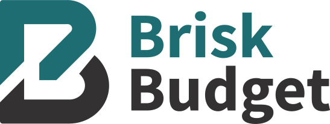
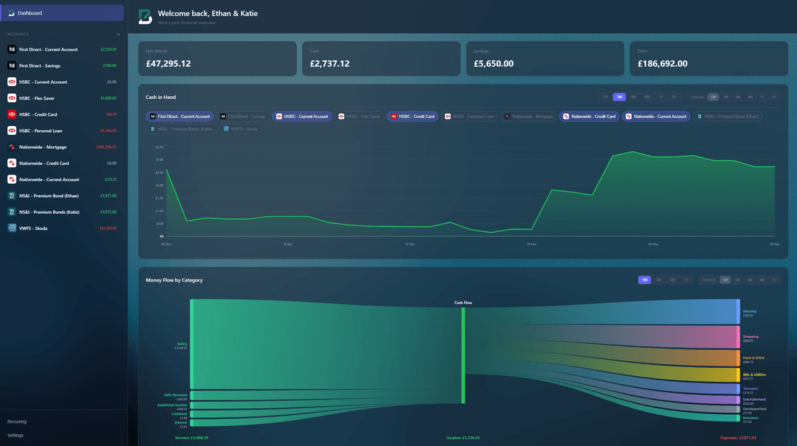

<p align="center">
  
</p>

A lightweight personal finance management web application for tracking household finances.



## Quick Deploy (Ubuntu)

Install with a single command:

```bash
curl -fsSL https://raw.githubusercontent.com/CoppingEthan/Brisk-Budget/main/deploy.sh | sudo bash
```

To update to the latest version, run the same command again.

The script will:
- Install Node.js and git if not present
- Clone the repository to `/opt/brisk-budget`
- Configure a systemd service for auto-start
- Preserve your data when updating

The app will be available at `http://localhost:3000`.

## Manual Deploy

1. Clone the repository
2. Install dependencies: `npm install`
3. Start the server: `npm start`
4. Open your browser to `http://localhost:3000`

For development with auto-reload: `npm run dev`

## Features

- **Account Management** - Track multiple accounts (checking, savings, loans, investments, assets)
- **Transaction Tracking** - Categorize and manage all your transactions with payees, notes, and descriptions
- **Recurring Transactions** - Automate regular expenses and income with customizable schedules
- **Inter-Account Transfers** - Link transactions between accounts seamlessly
- **Categories & Subcategories** - Organize spending with pre-configured or custom categories
- **Dashboard Analytics** - Visualize net worth, balance trends, and spending patterns
- **Transaction Import** - Bulk import transactions
- **Backup & Restore** - Download/restore data backups with automatic hourly backups
- **Mobile Responsive** - Works on desktop and mobile devices
- **PWA Support** - Install as a progressive web app

## Data Storage

All data is stored locally in JSON files in the `data/` directory. The application automatically creates this folder and initializes it on first run. No external database required.

## Configuration

All settings are managed through the application's settings page:
- Currency symbol
- Household name
- Categories and subcategories

## Tech Stack

- **Backend:** Node.js with native HTTP module
- **Frontend:** Vanilla JavaScript, CSS3
- **Storage:** File-based JSON

## Why I Built This

Simply, I couldn't find a good alternative to Microsoft Money. Everything was either a paid subscription, missing key features or had terrible UX for the average person. I wanted something simple, self-hosted and easy to use.

## Development & AI Usage

This project was coded with LLM assistance. I provided the concepts, architecture, UX/UI design, and branding. AI wrote the code iteratively as I tested each component. I'm a designer, not a full-stack developer but I'm learning as I go.

## License

MIT License - see LICENSE file for details

## Author

Ethan Copping

